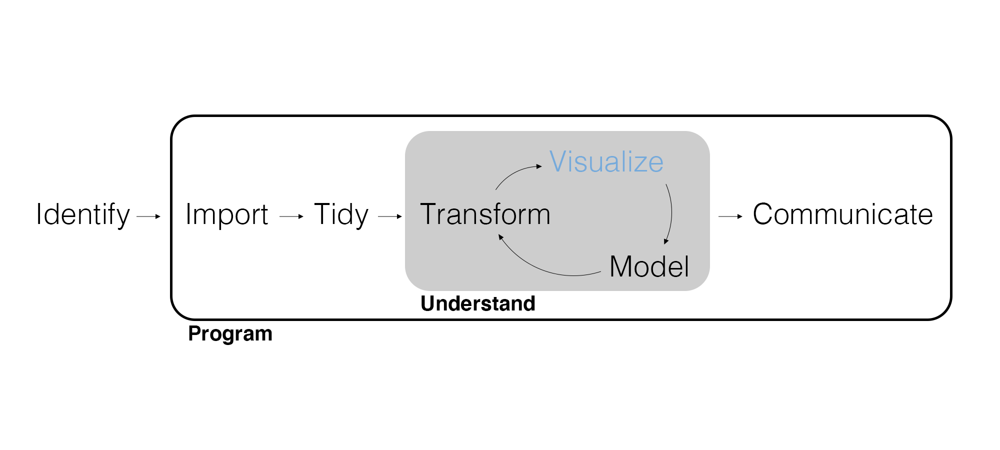
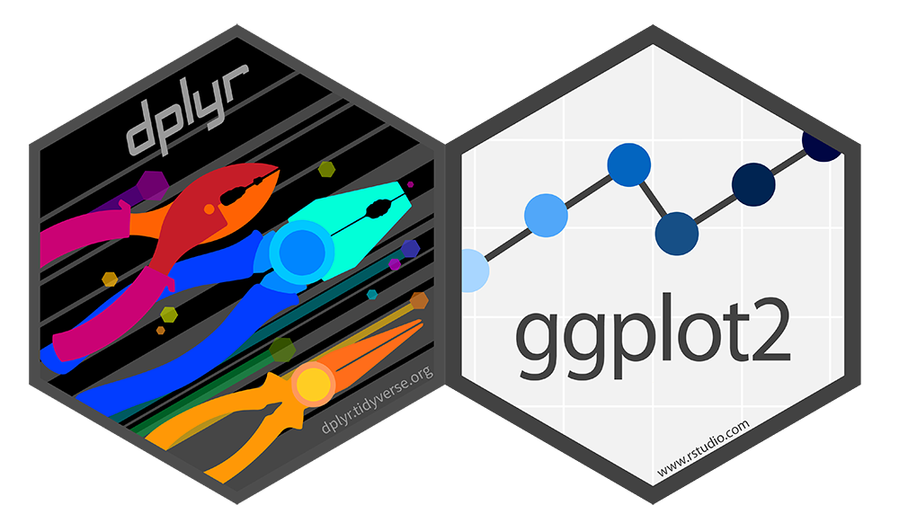
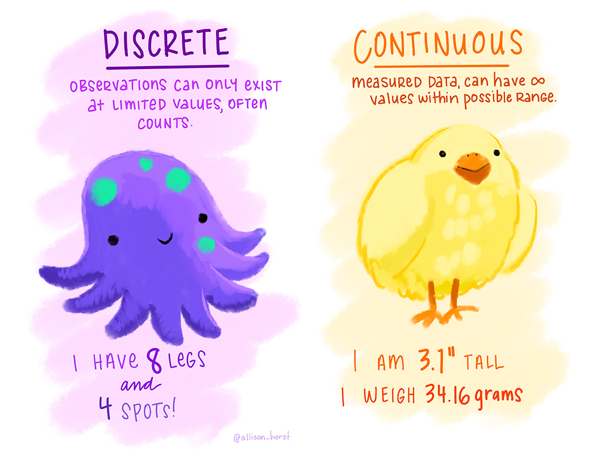
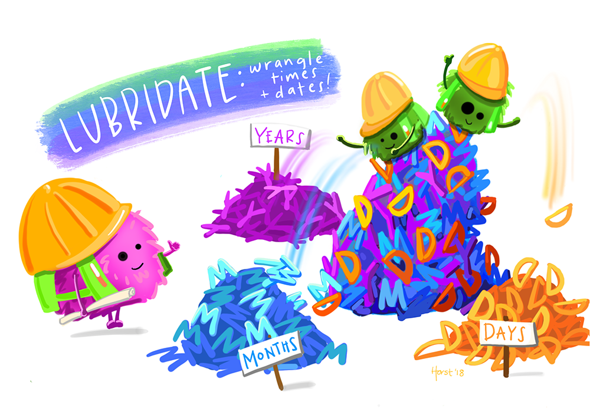
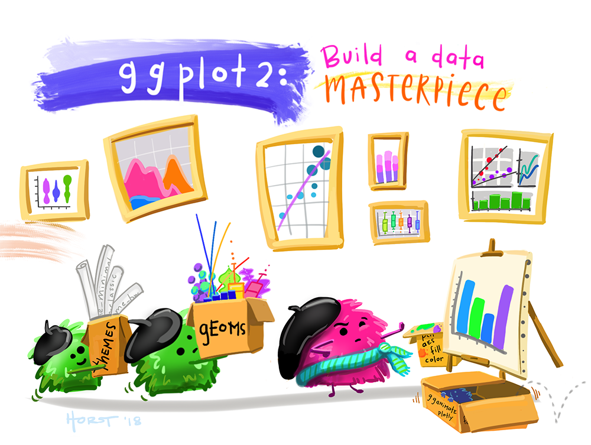

## Marketing Analytics Process

<center>
{width=900px}
</center>

---

{width=900px}

## Continuous Data

Remember that summarizing data is initially all about discovery, the heart of **exploratory data analysis**.

- Computing *statistics* (i.e., numerical summaries).
- *Visualizing* data (i.e., graphical summaries).

How we summarize depends on whether the data is *discrete* or **continuous**.

- Continuous means "forming an unbroken whole; without interruption."
- Continuous data are also called *quantitative* or *numeric*.

---

<center>
{width=700px}
</center>

---

```{r}
library(tidyverse)
```

---

What variables are *continuous*? What are their data types?

```{r eval=FALSE}
customer_data <- read_csv("customer_data.csv")
```

```{r echo=FALSE}
customer_data <- read_csv(here::here("Data", "customer_data.csv"))
```

## Summarize Continuous Data

One common statistic for a continuous variable is a **mean**.

```{r}
customer_data |>
  summarize(avg_income = mean(income))
```

Note that `summarize()` is more general than `count()` and can accommodate all sort of calculations - similar to `mutate()`. What is the main difference between `summarize()` and `mutate()`?

---

- Compute the mean of both `income` and `credit`.
- We can also compute the **mode**, **median**, **variance**, **standard deviation**, **minimum**, **maximum**, **sum**, etc.

---

```{r}
customer_data |>
  summarize(
    avg_income = mean(income),
    avg_credit = mean(credit)
  )
```

## Visualize Data

{ggplot2} provides a consistent **grammar of graphics** built with **layers**.

1. Data – Data to visualize.
2. Aesthetics – Mapping graphical elements to data.
3. Geometry – Or "geom," the graphic representing the data.
4. Facets, Labels, Scales, etc.

## Visualize Continuous Data

Let’s plot the **distribution** of income.

```{r eval=FALSE}
customer_data |> 
  ggplot(aes(x = income)) +
  geom_histogram()
```

---

```{r echo=FALSE}
customer_data |> 
  ggplot(aes(x = income)) +
  geom_histogram()
```

---

Visualize the relationship between `income` and `credit`.

```{r}
customer_data |> 
  ggplot(aes(x = income, y = credit)) +
  geom_point()
```

---

Visualize the relationship between `star_rating` and `income`.

```{r eval=FALSE}
customer_data |> 
  ggplot(aes(x = star_rating, y = income)) +
  geom_point()
```

---

```{r echo=FALSE}
customer_data |> 
  ggplot(aes(x = star_rating, y = income)) +
  geom_point()
```

---

What do we do if there is **overplotting**? There’s a geom for that (`geom_jitter()`).

- Drop the missing data before plotting.
- Play with the `size` and `alpha` geom arguments.
- Add a `geom_smooth()` layer.
- How could we look at this same plot by `region`?
- Complete the plot with labels.

---

```{r eval=FALSE}
customer_data |> 
  drop_na(star_rating) |> 
  ggplot(aes(x = star_rating, y = income)) +
  geom_jitter(size = 3, alpha = 0.5) +
  geom_smooth(method = "lm", se = FALSE) +
  facet_wrap(~ region) +
  labs(
    title = "Relationship Between Star Rating and Income by Region",
    x = "Star Rating",
    y = "Income"
  )
```

---

```{r echo=FALSE}
customer_data |> 
  drop_na(star_rating) |> 
  ggplot(aes(x = star_rating, y = income)) +
  geom_jitter(size = 3, alpha = 0.5) +
  geom_smooth(method = "lm", se = FALSE) +
  facet_wrap(~ region) +
  labs(
    title = "Relationship Between Star Rating and Income by Region",
    x = "Star Rating",
    y = "Income"
  )
```

## Summarize Continuous and Discrete Data

**Grouped summaries** provide a powerful solution for computing continuous statistics by discrete categories.

```{r}
customer_data |>
  group_by(gender) |>
  summarize(
    n = n(),
    avg_income = mean(income),
    avg_credit = mean(credit)
  )
```

---

Note how the `group_by()` function is a lot like the `facet_wrap()`, it filters the data by each category in the discrete group variable.

`count()` is a **wrapper** around a grouped summary using `n()`.

---

```{r}
customer_data |>
  group_by(gender) |>
  summarize(
    n = n()
  )
```

---

```{r}
customer_data |>
  count(gender)
```

---

We can group by more than one discrete variable.

```{r}
customer_data |>
  group_by(gender, region) |>
  summarize(
    n = n(),
    avg_income = mean(income),
    avg_credit = mean(credit)
  ) |> 
  arrange(desc(avg_income))
```

---

We can also use `slice_*()` functions along with `group_by()`.

```{r}
customer_data |>
  group_by(gender, region) |>
  slice_max(income, n = 3)
```

## Time Series Data

We often want to see how a variable changes over time: a **time series**. However, dates and times can be tricky.

```{r eval=FALSE}
customer_data |> 
  ggplot(aes(x = review_time, y = star_rating)) +
  geom_line()
```

---

```{r echo=FALSE}
customer_data |> 
  ggplot(aes(x = review_time, y = star_rating)) +
  geom_line()
```

---

There's a package for that!

```{r}
rating_data <- customer_data |> 
  drop_na(star_rating) |> 
  select(review_time, star_rating) |> 
  mutate(review_time = mdy(review_time))

rating_data
```

---

<center>
{width=800px}
</center>

---

```{r}
rating_data |> 
  ggplot(aes(x = review_time, y = star_rating)) +
  geom_line()
```

## Visualize Grouped Summaries

Let's summarize the data by a period of time and then plot the time series.

```{r eval=FALSE}
rating_data |> 
  mutate(review_year = year(review_time)) |> 
  group_by(review_year) |> 
  summarize(avg_star_rating = mean(star_rating)) |> 
  ggplot(aes(x = review_year, y = avg_star_rating)) +
  geom_line()
```

---

```{r echo=FALSE}
rating_data |> 
  mutate(review_year = year(review_time)) |> 
  group_by(review_year) |> 
  summarize(avg_star_rating = mean(star_rating)) |> 
  ggplot(aes(x = review_year, y = avg_star_rating)) +
  geom_line()
```

## Visualize Continuous and Discrete Data

Just like there are geoms for visualizing continuous or discrete data, there are geoms for visualizing the relationship between continuous and discrete data.

```{r eval=FALSE}
customer_data |> 
  ggplot(aes(x = income, y = gender)) +
  geom_boxplot()
```

---

```{r echo=FALSE}
customer_data |> 
  ggplot(aes(x = income, y = gender)) +
  geom_boxplot()
```

---

```{r}
customer_data |> 
  ggplot(aes(x = income, fill = gender)) +
  geom_density(alpha = 0.5)
```

## Embracing the Grammar of Graphics

Visualize the relationship between `income` and `credit`.

- Income is hard to read, let's recode it.
- Map `gender` to the `color` argument.
- Modify the `size` and `alpha` arguments.
- Add `geom_smooth()`.
- Can we get facets for each combination of `region` and `gender`?
- What happens when the `color` aesthetic is set in `geom_point()`?
- Add labels and modify the scale colors.
- Remove the gray default background by using a different theme. Try `theme_minimal()`.
- The legend for the scale is redundant, let's modify it using the `legend.position` argument in `theme()`.

---

```{r eval=FALSE}
customer_data |> 
  mutate(income = income / 1000) |> 
  ggplot(aes(x = income, y = credit)) +
  geom_point(size = 3, alpha = 0.5, aes(color = gender, )) +
  geom_smooth(method = "lm", se = FALSE) +
  facet_grid(gender ~ region) +
  labs(
    title = "Income and Credit by Region and Gender",
    x = "Income (in Thousands)",
    y = "Credit"
  ) +
  scale_color_manual(
    name = "Gender",
    values = c("violet", "purple", "turquoise")
  ) +
  theme_minimal() +
  theme(legend.position = "none")
```

---

```{r echo=FALSE}
customer_data |> 
  mutate(income = income / 1000) |> 
  ggplot(aes(x = income, y = credit)) +
  geom_point(size = 3, alpha = 0.5, aes(color = gender, )) +
  geom_smooth(method = "lm", se = FALSE) +
  facet_grid(gender ~ region) +
  labs(
    title = "Income and Credit by Region and Gender",
    x = "Income (in Thousands)",
    y = "Credit"
  ) +
  scale_color_manual(
    name = "Gender",
    values = c("violet", "purple", "turquoise")
  ) +
  theme_minimal() +
  theme(legend.position = "none")
```

---

<center>
{width=700px}
</center>

## Wrapping Up

*Summary*

- Computed grouped summaries.
- Practiced plotting with {ggplot2}, including some advanced options.

*Next Time*

- Creating reports (and almost anything else) using Quarto.
- Tidying data and the philosophy behind "tidy" data.

*Supplementary Material*

- *R for Data Science (2e)* Chapters 2 and 19

*Artwork by @allison_horst*

## Exercise 4

In RStudio on Posit Cloud, create a new R script and do the following.

1. Load the tidyverse.
2. Import and join `customer_data` and `store_transactions`.
3. Explore this combined dataset using the functions we've covered.
4. Provide at least one interesting numeric summary and one interesting visualization that include continuous variables.
5. Practice good coding conventions as discussed.
6. Export the R script and upload to Canvas.

